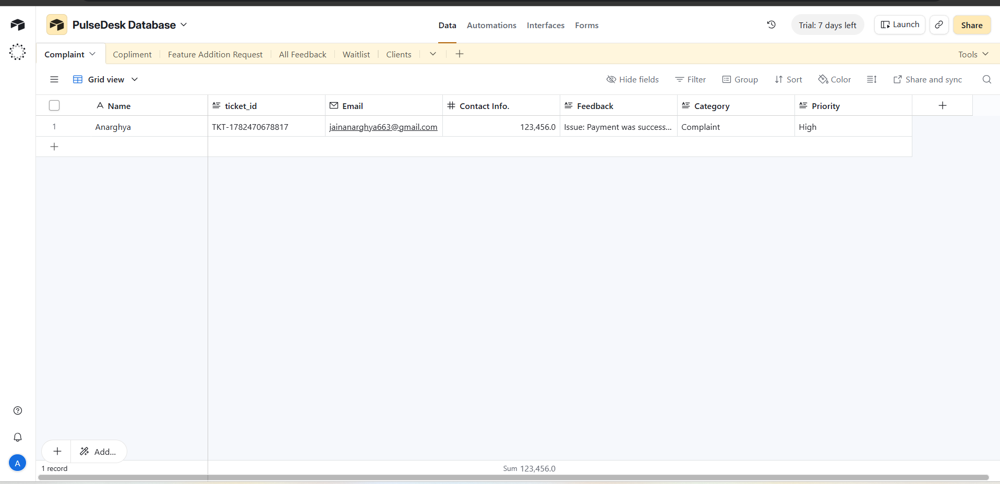

# PulseDesk AI

**PulseDesk AI** is an AI-powered customer feedback automation system that helps businesses automatically classify, prioritize, track, and manage customer feedback.
It can identify whether feedback is a **Complaint**, **Compliment**, or **Feature Request**, assign priority levels, generate ticket IDs, store data in Airtable, notify teams on Slack, send acknowledgement emails, and generate weekly analytics reports.

## Live Demo
Landing Page: https://anarghya1008.github.io/Pulsedesk-AI/

## Features

* AI-powered feedback classification
* Complaint / Compliment / Feature Request routing
* Priority detection: High, Medium, Low
* Unique ticket ID generation
* Centralized Airtable database
* Separate tables for complaints, compliments, and feature requests
* Slack alerts for team notifications
* Automatic complaint acknowledgement emails
* Ticket status tracking
* Weekly analytics reports
* Landing page with waitlist system

## Tech Stack

* n8n
* Google Gemini AI
* Airtable
* Slack
* Gmail
* JavaScript
* HTML/CSS
* GitHub Pages

## Workflow Overview

1. Customer submits feedback through a form.
2. AI analyzes the feedback.
3. Feedback is classified as Complaint, Compliment, or Feature Request.
4. Priority level is assigned.
5. A unique ticket ID is generated.
6. Data is stored in Airtable.
7. Relevant Slack channel receives notification.
8. Complaint customers receive acknowledgement emails.
9. Weekly analytics reports are generated automatically.

## Project Screenshots

### Landing Page

### n8n Workflow

### Airtable Database

### Slack Notification

### Gmail Acknowledgement Email

## Use Cases

* SaaS customer support
* E-commerce feedback management
* Coaching institute feedback handling
* Agency client feedback tracking
* Startup product feedback automation

## Project Status

This is the first working version of PulseDesk AI.
Future improvements may include duplicate complaint detection, advanced analytics dashboard, client login, subscription plans, and payment integration.

## Built By

**Anarghya Jain**
AI Automation & n8n Workflow Builder
